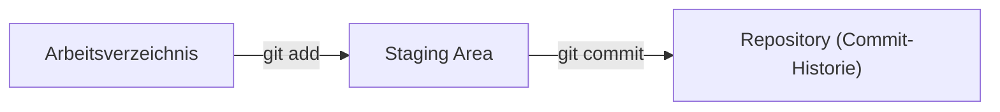
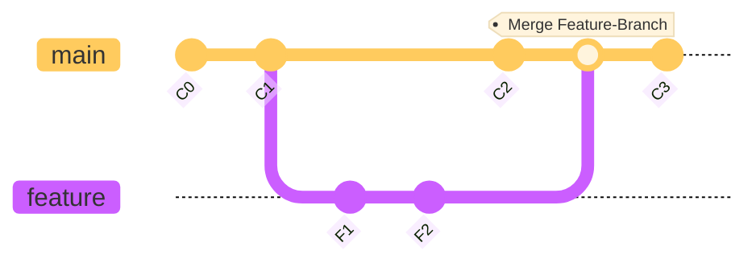
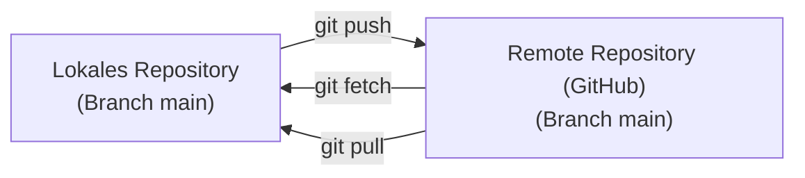

# Interaktives Git-Training für Studierende (Erste Schritte mit Git + GitHub)

**Willkommen zu diesem interaktiven Git-Tutorial!** In diesem Tutorial lernst Du die Grundlagen von Git und GitHub kennen und wendest sie direkt an. Es richtet sich an Bachelor-Studierende und ist so aufgebaut, dass es innerhalb einer Lehrveranstaltung von 90–120 Minuten durchgearbeitet werden kann. Du kannst das Tutorial auch eigenständig im Selbststudium durcharbeiten.

Wir werden gemeinsam ein kleines Beispielprojekt (bestehend aus einfachen Markdown-Dateien) unter Versionskontrolle stellen. Alle Git-Befehle führen wir im Terminal aus (z. B. Bash, zsh auf macOS/Linux oder CMD/Powershell auf Windows). Schritt für Schritt bauen wir ein lokales Repository auf, machen unsere ersten Commits, lernen Branches kennen, provozieren Merge-Konflikte und binden schließlich ein entferntes Repository auf GitHub ein. Zwischendurch findest Du Übungen und Quiz-Fragen zur Selbstkontrolle.

**Los geht’s!**

## Inhaltsverzeichnis

1. Einführung in Git und GitHub
2. Einrichtung eines lokalen Repositories
3. Erste Commits und Statuskontrolle, Repository-Hygiene
4. Änderungsverfolgung mit `diff` und weiteren Befehlen
5. Arbeiten mit Branches
6. Merge-Konflikte provozieren und lösen
7. Verbindung zu GitHub herstellen (Push & Pull)
8. Zusammenarbeit mit Pull Requests und `clone`
9. Abschließendes Mini-Quiz und Übungsaufgaben
10. Änderungen rückgängig machen und alte Versionen wiederherstellen
11. Arbeiten mit GitHub Codespaces und Unterschiede zur lokalen Umgebung
12. Wie geht es weiter mit Git?

---

## 1. Einführung in Git und GitHub

**Was ist Git?** Git ist ein verteiltes Versionsverwaltungssystem. Es hilft Entwicklern dabei, Änderungen am Code (oder auch an anderen Dateien) nachzuverfolgen und ermöglicht die Zusammenarbeit in Teams. Jede Änderung wird in einem Commit gespeichert, der eine Art Schnappschuss deines Projekts zu einem bestimmten Zeitpunkt darstellt. Du kannst dir Git als eine Timeline deiner Projekt-Historie vorstellen, in der Du jederzeit zurückspringen, parallele Entwicklungen verzweigen oder alte Versionen wiederherstellen kannst.

**Warum Versionskontrolle?** Stell dir vor, Du arbeitest an einem Software-Projekt und möchtest immer nachvollziehen können, wer was geändert hat und warum. Mit Git kannst Du:
	•	Änderungen Schritt für Schritt aufzeichnen und mit Nachrichten (Commit Messages) dokumentieren.
	•	Jederzeit ältere Versionen wiederherstellen oder Unterschiede vergleichen.
	•	Neue Features in separaten Branches entwickeln, ohne den Hauptcode zu gefährden.
	•	Effektiv mit anderen zusammenarbeiten: Git kann Änderungen von verschiedenen Entwicklern zusammenführen und Konflikte auflösen.

**Git vs. GitHub (oder GitLab, etc.):** Git ist das lokale Programm zur Versionskontrolle. GitHub dagegen ist ein Online-Dienst, um Git-Repositories in der Cloud zu speichern und mit anderen zu teilen. Ähnlich gibt es auch Alternativen wie GitLab oder Bitbucket. In diesem Tutorial werden wir GitHub nutzen, um ein Remote-Repository anzulegen und unsere Änderungen dorthin zu übertragen. Git selbst funktioniert aber auch völlig ohne GitHub – alle grundlegenden Aktionen kannst Du lokal ausführen.

> Hinweis: Dieses Tutorial verwendet Git ausschließlich über die Kommandozeile (Terminal). Es ist hilfreich, wenn Du Git bereits installiert hast (prüfe mit `git --version`). Falls Du Git zum ersten Mal nutzt, konfiguriere zunächst deinen Namen und deine E-Mail-Adresse, damit deine Commits korrekt zugeordnet werden können:

```shell
# EINGABE im Terminal

git config --global user.name "Max Mustermann"
git config --global user.email "max@beispiel.de"
```
(Ersetze Name und E-Mail durch deine eigenen Daten.)

Nun legen wir los und erstellen unser erstes Repository!

## 2. Einrichtung eines lokalen Repositories

Als erstes richten wir ein lokales Git-Repository für unser Beispielprojekt ein.

### Schritt 2.1: Projektordner anlegen
Erstelle einen neuen Ordner für das Projekt und wechsle in diesen Ordner:

```bash
# EINGABE im Terminal

rm -rf .git # ACHTUNG: NUR IN DIESEM TUTORIAL!
mkdir learn-git  
cd learn-git  
```
Dies wird unser Projektverzeichnis. Du kannst es beliebig benennen (wir nennen es hier `learn-git`).

**ACHTUNG: Das erste Kommando `rm -rf .git` wollen Sie in keinem eigenen Projekt ausführen!** Wir löschen damit ein Git-Repository, welches automatisch vorhanden ist, da wir uns in einem GitHub CodeSpace befinden. Damit wir weniger Potenzial für Verwechslungen in diesem Einstiegstutorial haben, löschen wir das Repository. So können wir frisch starten. 

### Schritt 2.2: Git-Repository initialisieren
Initialisiere in diesem Ordner ein neues Git-Repository mit:

```bash
# EINGABE im Terminal

git init
```
Dieser Befehl erstellt einen versteckten Unterordner `.git`, in dem Git alle Versionsverwaltungsinformationen speichert. Dein Projektordner ist nun ein Repository. Oft wird automatisch ein erster Branch namens `main` erstellt (in älteren Git-Versionen hieß der Standard-Branch `master`).

### Schritt 2.3: Ersten Inhalt erstellen
Lege eine einfache Markdown-Datei an, z. B. README.md, mit etwas Inhalt:

```bash
# EINGABE im Terminal

echo "# Mein Projekt" > README.md  
```

Damit erstellen wir eine Datei README.md mit einer Überschrift als Inhalt. Du kannst auch einen Editor öffnen und Text schreiben. Wichtig ist, dass nun eine neue Datei im Ordner liegt.

### Schritt 2.4: Status prüfen
Nutze `git status`, um den Zustand des Repositories zu überprüfen:

```bash
# EINGABE im Terminal

git status   
```

Du solltest eine Ausgabe sehen, die etwa so aussieht:

```shell
# AUSGABE im Terminal

On branch main

No commits yet

Untracked files:
  (use "git add <file>..." to include in what will be committed)
        README.md

nothing added to commit but untracked files present (use "git add" to track)
```
Git teilt uns mit, dass wir uns auf dem Branch `main` befinden und noch keine *Commits* existieren. Die Datei `README.md` wird als *untracked* (nicht verfolgt) aufgelistet – Git weiß also von dieser Datei, verfolgt aber ihre Inhalte noch nicht im Versionsverlauf.

## 3. Erste Commits und Statuskontrolle

Jetzt wollen wir unsere Änderungen mit Git aufnehmen, sprich einen **Commit** erstellen.

### Schritt 3.1: Datei zum Commit vormerken (stagen)
Bevor wir einen Commit ausführen, müssen wir Git mitteilen, welche Änderungen in den nächsten Commit aufgenommen werden sollen. Das geschieht mit `git add`. Füge unsere neue Datei zur **Staging Area** (Bereich zur Vorbereitung des Commits) hinzu:

```bash
# EINGABE im Terminal:

git add README.md  
```

Nun ist `README.md` im Zustand ***staged***. Das bedeutet, Git hat sich den aktuellen Stand der Datei gemerkt, um ihn beim nächsten Commit zu übernehmen.

Wenn Du jetzt erneut `git status` ausführst, siehst Du, dass die Datei zum Commit vorgemerkt ist:

```bash
# AUSGABE im Terminal

Changes to be committed:
  (use "git restore --staged <file>..." to unstage)
        new file:   README.md
```

### Schritt 3.2: Ersten Commit erstellen
Erzeuge nun den Commit mit `git commit`. Dabei solltest Du **immer** eine Commit-Mitteilung (`-m "aussagekräftige Nachricht"`) hinzufügen, die kurz erklärt, was geändert wurde:

```bash
# EINGABE im Terminal:

git commit -m "Initialer Commit: füge README.md hinzu"  
```
Nach Ausführen dieses Befehls erstellt Git einen neuen Commit. Die Ausgabe sieht etwa so aus:

```bash
# AUSGABE im Terminal:

[main (root-commit) 1a2b3c4] Initialer Commit: füge README.md hinzu
 1 file changed, 1 insertion(+)
 create mode 100644 README.md
```

Die genaue Commit-ID (hier `1a2b3c4` als Beispiel) wird bei dir anders aussehen. Git bestätigt, dass eine Zeile eingefügt wurde und die Datei nun unter Versionskontrolle steht.

Wenn Du wieder `git status` aufrufst, sollte jetzt stehen `„nothing to commit, working tree clean“`. Das bedeutet, es gibt keine ungespeicherten Änderungen – unser Repository ist auf dem aktuellen Stand des letzten Commits.

**Visualisierung**: Die Datei bewegt sich bildlich gesprochen vom Arbeitsverzeichnis über die Staging Area ins Repository:



### Schritt 3.3: Weitere Änderungen vornehmen
Lass uns noch einen Commit durchführen, um den Vorgang zu festigen. Öffne die Datei `README.md` in einem Editor (Explorer oben links, oder nutze `echo`/`printf`), und füge zum Beispiel eine zweite Zeile hinzu:

```bash
# Mein Projekt  
Dies ist ein Beispiel-Repository.  
```
Speichere die Änderung. Prüfe den Status:

```bash
# EINGABE im Terminal

git status
```

Ausgabe:

```bash
# AUSGABE im Terminal

On branch main  
Changes not staged for commit:  
  (use "git add <file>..." to update what will be committed)  
        modified:   README.md  
```

Die Datei wird als *modified* angezeigt – geändert, aber noch nicht für den Commit vorgemerkt.

Stagen und committen wir auch diese Änderung:

```bash
# EINGABE im Terminal

git add README.md  
git commit -m "Beschreibung im README ergänzt"  
```

Wieder bestätigt Git den Commit (z. B. `„1 file changed, 1 insertion(+), 0 deletions(-)“`).

Wir haben nun zwei Commits in unserer Repository-Historie. Das können wir uns auch anschauen.

### Schritt 3.4: Commit-Historie ansehen
Um die bisherigen Commits anzusehen, benutzen wir `git log`:

```bash
# EINGABE im Terminal

git log
```
Dies listet die Commits (in absteigender Reihenfolge) inklusive ihrer IDs, Autoren und Nachrichten. Die Ausgabe könnte so aussehen:

```bash
# AUSGABE im Terminal

commit 9fceb02e... (HEAD -> main)  
Author: Max Mustermann <max@beispiel.de>  
Date:   Wed Mar 19 12:34:56 2025 +0100  

    Beschreibung im README ergänzt

commit 1a2b3c4d...  
Author: Max Mustermann <max@beispiel.de>  
Date:   Wed Mar 19 12:30:00 2025 +0100  

    Initialer Commit: füge README.md hinzu
```

Der neueste Commit steht oben. `HEAD -> main` zeigt an, dass `HEAD` (der Zeiger auf den aktuellen Stand) auf dem Branch `main` auf diesen Commit zeigt.

Wir können die Log-Ausgabe mit Optionen anpassen. Ein nützlicher Tipp:

```bash
# EINGABE im Terminal

git log --oneline --graph --all  
```

Dies zeigt die Historie kompakt (jede Commit-ID gekürzt mit der Nachricht) und mit `--graph --all` sogar grafisch mit verzweigten Linien, falls Branches existieren. In unserem Fall ist es noch ein linearer Verlauf:

```bash
# AUSGABE im Terminal

* 9fceb02 (HEAD -> main) Ergänze Beschreibung im README  
* 1a2b3c4 Initialer Commit: füge README.md hinzu  
```

Wir haben jetzt erfolgreich ein lokales Repository erstellt und zwei Commits darin gespeichert!

### 3.5 Was gehört alles in ein Git-Repository – und was nicht?

Ein Git-Repository sollte **nur die relevanten Dateien** enthalten, die du oder dein Team **selbst bearbeiten** oder **versionieren** möchten. Alles, was automatisch generiert wird, sollte außen vor bleiben.

#### ✅ In ein Git-Repository gehören:
- Quellcode-Dateien (z. B. `.py`, `.java`, `.md`, `.tex`, etc.)
- Dokumentation (`README.md`, Projektpläne, Design-Dokumente)
- Build-Skripte, Konfigurationsdateien, Makefiles
- `.gitignore` und ggf. `.gitattributes`

#### ❌ Nicht ins Repository gehören:
- Kompilierte oder generierte Dateien (`*.class`, `*.o`, `*.exe`, `*.pdf`)
- Temporäre Dateien (`~`, `.DS_Store`, `.swp`, `.log`)
- Persönliche Einstellungen oder lokale Pfade
- **Geheime Informationen (Secrets)**: Passwörter, Tokens, Zugangsdaten

> ⚠️ **WICHTIGE WARNUNG:**  
> **Niemals Passwörter, Zugangsdaten oder API-Schlüssel in einem Git-Repository speichern – auch nicht versehentlich!**  
> Selbst in einem privaten Repository können sie durch einen `push` langfristig in der Historie sichtbar bleiben.  
> Wenn du versehentlich ein Secret committed hast, lösche es mit Tools wie [`git filter-repo`](https://github.com/newren/git-filter-repo) oder [`BFG Repo-Cleaner`](https://rtyley.github.io/bfg-repo-cleaner/). **Passwörter, Credentials, Token, etc., die einmal in einem Git-Repository gelandet sind, gelten als kompromittiert! Sie müssen zwingend erneuert werden.** Sicherheitsvorfälle sind auf geleakte Secrets in Repositories zurückzuführen. [Hier](https://blog.gitguardian.com/leaked-secrets-in-code-repositories/) gibt es bei Interesse weitere Details zu lesen. Hier gibt es ein informatives Video: [2 million .git directories exposed! Why .git folders are sensitive & how they are leaked publicly](https://youtu.be/H-_KtGqSk3I?si=BDU4zgwUSzrSOcHj).

---

#### Die Datei `.gitignore`

`.gitignore` ist eine Textdatei im Wurzelverzeichnis des Repositories, in der du Dateien oder Verzeichnisse angibst, die Git **ignorieren** soll.

Beispiel `.gitignore`:

```
# ignoriert alle .log-Dateien
*.log

# ignoriert alle PDF-Dateien im gesamten Projekt
*.pdf

# ignoriert den Ordner build/ im Projektverzeichnis
build/

# ignoriert temporäre Dateien von VSCode und macOS
.vscode/
.DS_Store
```

Erstelle die `.gitignore` mit einem Editor oder direkt per Kommando:

```bash
echo "*.log" >> .gitignore
```

> 💡 Viele Templates für `.gitignore` findest du unter: [https://github.com/github/gitignore](https://github.com/github/gitignore)

---

### 3.6 Dateien entfernen – `rm` vs. `git rm`

Wenn du eine Datei aus dem Projekt löschen willst, stehen dir zwei Möglichkeiten offen:

#### 🧹 Normales Löschen mit `rm` (Unix) oder `del` (Windows)

```bash
rm datei.txt
```

Diese Datei ist nun gelöscht – **aber Git weiß noch nichts davon!**

Bei `git status` siehst du:

```
deleted:    datei.txt
```

Du musst die Änderung **noch stagen**, um sie zu committen:

```bash
git add -u
git commit -m "Entferne datei.txt"
```

---

#### ✅ Löschen mit `git rm` – empfohlene Methode

```bash
git rm datei.txt
git commit -m "Entferne datei.txt"
```

Dies löscht die Datei und markiert sie sofort für den nächsten Commit.

---

#### 🔁 Datei nur aus Git entfernen, aber lokal behalten

Manchmal willst du eine Datei **nicht mehr versionieren**, aber **lokal behalten** (z. B. weil sie versehentlich committed wurde). Dann verwende:

```bash
git rm --cached datei.txt
```

Jetzt wird die Datei im nächsten Commit entfernt, aber bleibt auf deiner Festplatte erhalten.

---

### 3.7 Dateien verschieben – `mv` vs. `git mv`

Auch beim Umbenennen oder Verschieben möchtest du Git mitteilen, **was genau passiert ist**.

#### 🔀 Normales Umbenennen oder Verschieben:

```bash
mv alt.md neu.md
```

Git sieht das zunächst als „Löschen + neue Datei“:

```bash
git status
# deleted:   alt.md
# new file:  neu.md
```

Das funktioniert, aber die Historie des alten Dateinamens geht **optisch verloren**.

---

#### ✅ Empfohlen: Git-verschieben

```bash
git mv alt.md neu.md
git commit -m "Benenne alt.md um in neu.md"
```

Git erkennt die Umbenennung und verfolgt die Datei-Historie zuverlässig weiter.

> 💡 Git ist *inhaltlich basiert*. Selbst wenn du manuell verschiebst und beide Dateien sehr ähnlich sind, kann Git später erkennen, dass es sich um dieselbe Datei handelt – aber `git mv` ist klarer und sauberer.

---

### 3.8 Binärdateien & große Dateien – Git LFS

Git ist optimiert für **Textdateien**, nicht für Binär- oder große Mediendateien.

#### ❌ Nicht geeignet:
- `.zip`, `.mp4`, `.psd`, `.iso`, `.exe`

Diese machen dein Repository langsam und blähen es unnötig auf.

#### ✅ Lösung: [Git LFS](https://git-lfs.github.com/)
Mit Git LFS (Large File Storage) kannst du große Dateien auslagern. Git speichert nur einen Verweis auf die Datei, der Inhalt liegt extern.

Installation:

```bash
git lfs install
git lfs track "*.psd"
```

Git legt dann eine `.gitattributes`-Datei an.

---

### 3.9 Temporäre, persönliche Ausschlüsse: `.git/info/exclude`

Wenn du **eine Datei nur auf deinem System** ignorieren willst (ohne sie in `.gitignore` zu schreiben), verwende:

```bash
.git/info/exclude
```

Das funktioniert genauso wie `.gitignore`, betrifft aber **nur dein lokales Git** – praktisch für z. B. `config.local.json`.

---

### 3.10 Nachträgliches Ignorieren von Dateien

Du hast eine Datei bereits committed, willst sie aber künftig ignorieren?

```bash
git rm --cached datei.conf
echo "datei.conf" >> .gitignore
git commit -m "Entferne datei.conf aus Git und ignoriere sie künftig"
```

So wird die Datei **aus dem Git-Verlauf entfernt**, aber lokal behalten – und in Zukunft nicht mehr versioniert.

### 3.11 Übungsaufgaben: `.gitignore`, Dateien löschen & verschieben, Repository-Hygiene

Diese Aufgaben helfen dir dabei, typische Fallstricke beim Umgang mit Dateien in Git zu erkennen und zu beherrschen. Sie eignen sich zur Selbstübung oder zur Bearbeitung in Partnerarbeit.

---

#### 🧹 Aufgabe 1: `.gitignore` erstellen und testen

**Ziel:** Verstehe, wie `.gitignore` funktioniert, und übe den Umgang mit temporären Dateien.

1. Erstelle im Projektverzeichnis folgende Dateien:
   ```
   notizen.txt
   test.log
   geheim.txt
   ```
2. Erstelle eine Datei `.gitignore` mit folgendem Inhalt:
   ```
   *.log
   geheim.txt
   ```
3. Führe `git status` aus. Welche Dateien werden angezeigt? Welche nicht?
4. Füge nur `notizen.txt` zum Repository hinzu und committe.
5. Verwende `git ls-files`, um zu überprüfen, welche Dateien getrackt werden.

**Bonus:**  
Erweitere `.gitignore`, sodass alle Dateien im Unterordner `tmp/` ignoriert werden – auch neue.

---

#### 🛑 Aufgabe 2: Datei löschen – `rm` vs. `git rm`

**Ziel:** Unterscheide zwischen dem Löschen im Dateisystem und dem Entfernen aus der Git-Historie.

1. Erstelle und committe eine Datei `bericht.md`.
2. Entferne sie mit:
   ```bash
   rm bericht.md
   ```
3. Was zeigt `git status`?
4. Stufe die Änderung mit `git add -u` oder mit `git rm bericht.md` für den nächsten Commit ein.
5. Committe die Löschung.

**Bonus:**  
Füge die Datei wieder hinzu (neu anlegen oder per `git checkout HEAD bericht.md`) und committe erneut.

---

#### 🔁 Aufgabe 3: Datei umbenennen mit `git mv`

**Ziel:** Verstehe, wie Git Datei-Umbenennungen erkennt und historisch verfolgt.

1. Erstelle und committe eine Datei `plan.md`.
2. Benenne sie um:
   ```bash
   git mv plan.md projektplan.md
   ```
3. Committe die Änderung.
4. Nutze `git log --follow projektplan.md`, um die vollständige Historie der Datei zu sehen.

**Alternative:**  
Verschiebe die Datei mit `mv` und führe anschließend `git add` und `git rm` manuell aus. Erkennt Git die Umbenennung?

---

#### 🕵️‍♂️ Aufgabe 4: Versehentlich ein Secret committed?

**Ziel:** Lerne, wie du sensible Dateien wieder aus der Git-Historie entfernst.

1. Erstelle eine Datei `token.txt` mit folgendem Inhalt:
   ```
   SECRET_KEY=1234567890abcdef
   ```
2. Füge sie dem Repository hinzu und committe.
3. Stelle fest, dass dies ein Fehler war.
4. Entferne die Datei aus Git, aber **nicht vom Rechner**:
   ```bash
   git rm --cached token.txt
   echo "token.txt" >> .gitignore
   git commit -m "Entferne Secret aus Git und ignoriere künftig"
   ```
5. Prüfe mit `git status`, dass die Datei nicht mehr getrackt wird.

> ⚠️ Hinweis: Diese Methode entfernt die Datei **nicht aus der Git-Historie**! Verwende in realen Projekten Tools wie `git filter-repo` oder `BFG Repo Cleaner`, um sensible Daten vollständig zu löschen. 

---

#### 🧠 Aufgabe 5: Denk- und Diskussionsfragen

Beantworte folgende Fragen schriftlich oder bespreche sie im Team:

1. Warum sollten z. B. `.pdf`- oder `.zip`-Dateien nicht versioniert werden?
2. Wann ist `git rm --cached` sinnvoll – und wann gefährlich?
3. Warum ist `.gitignore` kein Sicherheitsmechanismus?
4. Welche Tools helfen, große oder sensible Dateien aus der Git-Historie zu entfernen?
5. Was passiert, wenn du eine Datei ignorierst, die **bereits** getrackt ist?

---

#### 📁 Bonus: Sauberes Repository planen

> Ideal als Hausaufgabe oder als Gruppenübung vor Projektbeginn

1. Du möchtest ein neues Projekt starten (z. B. mit LaTeX, Node.js, C++, Python).
2. Recherchiere:
   - Welche Dateien oder Ordner entstehen beim Kompilieren, Installieren oder Ausführen?
   - Welche davon sollten nicht ins Git-Repository?
3. Erstelle eine passende `.gitignore`-Datei.
4. Diskutiere:
   - Welche Dateien sollen versioniert werden?
   - Welche gehören **nicht** ins Repository?
   - Wo könnten versehentlich persönliche Daten landen?

---

Diese Übungen helfen dir dabei, deine Repositories übersichtlich, sicher und sauber zu halten – und typische Anfängerfehler zu vermeiden.


<details>
<summary>💡 <strong>Lösungen und Hinweise zu den Aufgaben anzeigen</strong></summary>

---

### ✅ Aufgabe 1: `.gitignore` erstellen und testen

- `test.log` und `geheim.txt` werden **nicht angezeigt**, weil sie durch `.gitignore` ausgeschlossen sind.
- Nur `notizen.txt` ist sichtbar in `git status`.
- `git ls-files` zeigt nur Dateien, die tatsächlich versioniert sind → also nur `notizen.txt`.

**Bonus:**  
Zum Ignorieren des ganzen `tmp/`-Ordners:
```
tmp/
```

---

### ✅ Aufgabe 2: Datei löschen – `rm` vs. `git rm`

- `rm` löscht die Datei nur aus dem Dateisystem → Git erkennt sie als gelöscht (`deleted`), aber du musst selbst `add` oder `rm` machen.
- `git rm` erledigt beides in einem Schritt: Entfernen der Datei und Aufnahme in den Index.
- `git status` zeigt in beiden Fällen einen Löschvorgang, aber nur bei `git rm` ist die Datei bereits gestaged.

---

### ✅ Aufgabe 3: Datei umbenennen

- Mit `git mv` wird die Umbenennung sauber erkannt.
- `git log --follow projektplan.md` zeigt die vollständige Historie inkl. der Zeit als `plan.md`.
- Wenn du nur `mv` + `git add` + `git rm` verwendest, erkennt Git die Änderung *meistens*, aber nicht garantiert – besonders bei stark geänderten Dateien.

---

### ✅ Aufgabe 4: Secret wieder entfernen

- Mit `git rm --cached` entfernst du die Datei **aus dem Index**, sie bleibt lokal erhalten.
- `.gitignore` sorgt dafür, dass sie künftig nicht wieder versehentlich hinzugefügt wird.
- In `git log` ist die Datei weiterhin enthalten – sie ist **nicht gelöscht**, sondern nur aus zukünftigen Commits ausgeschlossen.

> In der Realität: Verwende `git filter-repo` oder `BFG` zur vollständigen Entfernung!

---

### ✅ Aufgabe 5: Diskussion

**Mögliche Antworten:**

1. **PDFs / ZIPs:** Sind binär, können nicht sinnvoll diffbar gemacht werden, verursachen große Repos und Merge-Konflikte.
2. **`git rm --cached`:** Nützlich für versehentlich getrackte Dateien; gefährlich, wenn es sensible Daten betrifft oder man denkt, die Datei sei komplett entfernt.
3. **`.gitignore` schützt nicht!** Sie verhindert nur, dass Dateien *neu* hinzukommen – was schon im Repo ist, bleibt sichtbar.
4. **Tools:** [`git filter-repo`](https://github.com/newren/git-filter-repo), [`BFG Repo-Cleaner`](https://rtyley.github.io/bfg-repo-cleaner/)
5. **Bereits getrackte Dateien** werden von `.gitignore` ignoriert, aber weiterhin versioniert – man muss sie manuell entfernen mit `git rm --cached`.

---
</details>
---

## 4. Änderungsverfolgung mit `diff` und weiteren Befehlen

Git bietet viele Möglichkeiten, Änderungen nachzuvollziehen und den Zustand deines Projekts zu überprüfen. Wir schauen uns einige wichtige Befehle an: `git diff`, `git status` und `git log` für verschiedene Zwecke.

### 4.1 Änderungen vor dem Commit vergleichen (`git diff`)

Wenn Du eine Datei bearbeitet hast, aber **noch kein `git add`** ausgeführt hast, kannst Du mit `git diff` die **noch nicht gestagten** Änderungen ansehen:

```bash
git diff
```

Beispielausgabe:

```diff
diff --git a/README.md b/README.md
index e42baca..c5f5678 100644
--- a/README.md
+++ b/README.md
@@
 Dies ist ein Beispiel-Repository.
+Hier fügen wir einen neuen Satz hinzu.
```

Das `+` zeigt neu hinzugefügte Zeilen, `-` zeigt entfernte Zeilen. So kannst Du genau sehen, was Du seit dem letzten Commit geändert hast.

### 4.2 Gestagte Änderungen anzeigen

Wenn Du `git add` schon ausgeführt hast und sehen willst, **was im nächsten Commit landen wird**, nutze:

```bash
# EINGABE im Terminal

git diff --staged
```

### 4.3 Unterschiede zwischen zwei Commits vergleichen

Du kannst auch Änderungen **zwischen zwei beliebigen Commits** anzeigen:

```bash
# EINGABE im Terminal

git diff <commit1> <commit2>
```

Beispiel:

```bash
# EINGABE im Terminal

git diff HEAD~1 HEAD
```

Vergleicht den aktuellen Commit (`HEAD`) mit dem vorherigen (`HEAD~1`).

### 4.4 Änderungen in der Commit-Historie anzeigen

Mit `git log -p` siehst Du die Commit-Historie **inklusive Diffs**:

```bash
# EINGABE im Terminal

git log -p -2
```

Zeigt die letzten zwei Commits und die jeweiligen Änderungen im Detail.

Oder kompakter:

```bash
# EINGABE im Terminal

git log --oneline --graph --all
```

Beispielausgabe:

```bash
# AUSGABE im Terminal

* 9fceb02 (HEAD -> main) Füge weiteren Satz zur Beschreibung hinzu
* 1a2b3c4 Initialer Commit: füge README.md hinzu
```

### 4.5 Visualisierung des Git-Flows


Dieses Diagramm zeigt den Weg von Änderungen im Arbeitsverzeichnis über die Staging-Area bis zum Repository.

### ✅ Zusammenfassung

| Aktion                            | Befehl                   |
|-----------------------------------|---------------------------|
| Unterschied zur letzten Version  | `git diff`               |
| Unterschied zwischen zwei Commits| `git diff A B`           |
| Gestagte Änderungen anzeigen     | `git diff --staged`      |
| Commit-Historie ansehen          | `git log` / `git log -p` |
| Kompakte Historie                | `git log --oneline --graph --all` |

---

## 5. Arbeiten mit Branches

Ein mächtiges Feature von Git sind *Branches* (Zweige). Branches erlauben es dir, parallel zum Hauptzweig (oft `main` genannt) zu arbeiten – beispielsweise, um neue Features zu entwickeln, ohne den stabilen Code zu gefährden. Du kannst Änderungen auf einem Branch vornehmen und später mit einem anderen Branch zusammenführen (*merge*).

Stellen wir uns Branches als parallele Entwicklungslinien vor:


```
Legende:
C0: Start
C1: Änderung auf main
C2: Weitere Änderung auf main
C3: Merge Feature-Branch
F1: Feature begonnen
F2: Feature fortgesetzt
```

**Schritt-für-Schritt:**

1. **Neuen Branch erstellen und wechseln:**  
   ```bash
   # EINGABE im Terminal

   git checkout -b feature1
   ```
   Dies erstellt den Branch `feature1` und wechselt direkt darauf.

2. **Änderungen auf dem neuen Branch vornehmen:**  
   Erstelle z. B. eine neue Datei `FEATURE.md`:
   
   ```bash
   # EINGABE im Terminal

   echo "Dies ist eine neue Feature-Datei." > FEATURE.md
   git add FEATURE.md
   git commit -m "Füge FEATURE.md auf Branch feature1 hinzu"
   ```
   Du kannst auch bestehende Dateien (wie `README.md`) anpassen und committen.

3. **Zum Hauptbranch zurückkehren:**  
   ```bash
   # EINGABE im Terminal

   git checkout main
   ```

4. **Änderungen auf `main` vornehmen:**  
   Bearbeite z. B. `README.md` und führe einen Commit aus:
   ```bash
   # EINGABE im Terminal

   git add README.md
   git commit -m "Dokumentation auf main erweitert"
   ```

5. **Branch zusammenführen (Merge):**  
   Stelle sicher, dass Du auf `main` bist, und führe den Merge aus:
   ```bash
   # EINGABE im Terminal

   git merge feature1
   ```
   Je nach Situation erfolgt ein *Fast-Forward* oder ein Merge-Commit.

---

## 6. Merge-Konflikte provozieren und lösen

Manchmal ändern verschiedene Branches **dieselben Zeilen** in einer Datei, sodass beim Zusammenführen ein Konflikt entsteht. Wir werden nun Konflikte provozieren, um sie anschließend exemplarisch zu lösen:

**Schritt 6.1: Konflikt erzeugen**

1. Erstelle einen neuen Branch `conflict-demo` von `main`:
   ```bash
   # EINGABE im Terminal

   git checkout -b conflict-demo
   ```
2. Bearbeite `README.md` und ändere beispielsweise die Überschrift:
   ```markdown
   # Mein Projekt (Feature-Version)
   ```
   Committe die Änderung:

   ```bash
   # EINGABE im Terminal
   
   git add README.md
   git commit -m "Passe Überschrift in README auf conflict-demo an"
   ```

3. Wechsel zurück zu `main`:
   ```bash
   # EINGABE im Terminal
   
   git checkout main
   ```
4. Ändere in `README.md` dieselbe Zeile, z. B. zu:
   ```markdown
   # Mein Projekt (Main-Version)
   ```
   Committe auch diese Änderung:
   ```bash
   # EINGABE im Terminal
   
   git add README.md
   git commit -m "Passe Überschrift in README auf main an"
   ```

**Schritt 6.2: Merge durchführen und Konflikt lösen**

1. Versuche, den Branch `conflict-demo` in `main` zu mergen:
   ```bash
   # EINGABE im Terminal
   
   git merge conflict-demo
   ```
   Git meldet einen Konflikt und fügt Markierungen in `README.md` ein:

   ```diff
   <<<<<<< HEAD
   # Mein Projekt (Main-Version)
   =======
   # Mein Projekt (Feature-Version)
   >>>>>>> conflict-demo
   ```

2. Öffne `README.md` und entscheide, welche Version übernommen werden soll (oder kombiniere beide). Entferne die Konflikt-Markierungen.
3. Nachdem der Konflikt gelöst ist, markiere die Datei als gelöst:
   ```bash
   # EINGABE im Terminal
   
   git add README.md
   ```
4. Schließe den Merge ab:
   ```bash
   # EINGABE im Terminal
   
   git commit -m "Merge conflict-demo (Konflikt gelöst)"
   ```

Optional kannst Du den Branch `conflict-demo` löschen, wenn er nicht mehr benötigt wird:
```bash
# EINGABE im Terminal
   
git branch -d conflict-demo
```

---

## 7. Verbindung zu GitHub herstellen (Push, Pull & Fetch)

Bisher haben wir lokal gearbeitet. Jetzt binden wir ein Remote-Repository auf GitHub ein, um unsere Änderungen online zu sichern und mit anderen zu teilen.

---

### 7.1 Repository auf GitHub erstellen

- Gehe auf [https://github.com](https://github.com) und erstelle ein neues Repository, z. B. mit dem Namen `lern-git`.
- **Wichtig:** Aktiviere *nicht* die Optionen für README, .gitignore oder Lizenz – wir haben diese Dateien lokal bereits angelegt.

---

### 7.2 Remote-Verbindung hinzufügen

Verbinde dein lokales Repository mit dem auf GitHub:

```bash
# EINGABE im Terminal
git remote add origin https://github.com/<Benutzername>/lern-git.git
```

Ersetze `<Benutzername>` durch deinen GitHub-Namen.  
Du kannst mit `git remote -v` prüfen, ob die Verbindung korrekt gesetzt wurde:

```bash
# EINGABE im Terminal
git remote -v
```

Ausgabe:

```
# AUSGABE im Terminal
origin  https://github.com/<Benutzername>/lern-git.git (fetch)
origin  https://github.com/<Benutzername>/lern-git.git (push)
```

---

### 7.3 Änderungen ins Remote-Repo hochladen (Push)

Sende den aktuellen Stand des Branches `main` zum Remote:

```bash
# EINGABE im Terminal
git push -u origin main
```

Erklärung:
- `push`: Überträgt deine lokalen Commits zum Remote
- `-u`: Merkt sich die Verbindung zu `origin/main`, sodass Du künftig einfach `git push` eingeben kannst

Nach dem ersten Push ist dein Projekt online sichtbar auf GitHub.

---

### 7.4 Änderungen vom Remote holen (Pull)

Wenn Du direkt auf GitHub eine Datei bearbeitest (z. B. über das Webinterface), entsteht dort ein neuer Commit. Um diese Änderungen **lokal** zu bekommen:

```bash
# EINGABE im Terminal
git pull origin main
```

Dieser Befehl:
1. Lädt neue Commits vom Remote herunter (**fetch**)
2. Fügt sie mit deinem lokalen Branch zusammen (**merge**)

---

### 7.5 Was macht `git fetch`?

Der Befehl `git fetch` lädt alle neuen Änderungen vom Remote-Repository **ohne sie sofort in deinen aktuellen Branch zu integrieren**.

```bash
# EINGABE im Terminal
git fetch origin
```

Danach kannst Du z. B. die Unterschiede prüfen:

```bash
# EINGABE im Terminal
git log origin/main
```

Oder explizit mergen:

```bash
# EINGABE im Terminal
git merge origin/main
```

**Zusammenfassung:**

| Befehl        | Bedeutung                                    |
|---------------|----------------------------------------------|
| `git fetch`   | Holt neue Daten vom Remote, **ohne Merge**   |
| `git merge`   | Integriert Änderungen in den aktuellen Branch |
| `git pull`    | Macht `fetch` + `merge` in einem Schritt     |

> 💡 `git fetch` ist sicherer, wenn Du zuerst sehen möchtest, **was sich verändert hat**, bevor Du deinen Branch aktualisierst.

---

### 7.6 Visualisierung des Remote-Workflows



- `push`: Sende lokale Änderungen zu GitHub
- `fetch`: Hole Remote-Änderungen, **aber ohne sie einzubauen**
- `pull`: Hole Remote-Änderungen **und integriere sie sofort**

---

Jetzt bist Du bereit, mit GitHub produktiv zu arbeiten – sowohl lokal als auch remote!

---

## 8. Zusammenarbeit mit Pull Requests und `clone`

In Projekten arbeiten häufig mehrere Personen zusammen. Zwei gängige Vorgehensweisen sind:

### 8.1 Repository klonen

Ein Entwickler klont das Remote-Repository:
```bash
git clone https://github.com/<Benutzername>/learn-git.git learn-git-kopie
cd learn-git-kopie
```

### 8.2 Änderungen als anderer Entwickler vornehmen

Erstelle einen neuen Branch, nimm eine Änderung vor und pushe diesen:
```bash
git checkout -b feature-von-kollege
echo "Diese Zeile fügt der Kollege hinzu." >> README.md
git add README.md
git commit -m "Kollege: Ergänze Hinweis in README"
git push -u origin feature-von-kollege
```

### 8.3 Pull Request erstellen

Auf GitHub kann dann ein **Pull Request** eröffnet werden, um die Änderungen aus `feature-von-kollege` in `main` zu mergen.

### 8.4 Änderungen lokal synchronisieren

Nach dem Mergen der Pull Request:
```bash
git pull origin main
```

---

## 9. Abschließendes Mini-Quiz und Übungsaufgaben

**Quiz-Fragen:**

1. Welchen Befehl nutzt man, um den aktuellen Unterschied zwischen Arbeitsverzeichnis und letztem Commit zu sehen?  
   a) `git status`  
   b) `git diff`  
   c) `git log`

2. Wie erstellt man einen neuen Branch und wechselt direkt darauf?  
   (Tipp: Ein einzelner Befehl.)

3. Was muss getan werden, bevor Änderungen in einem Commit landen?  

4. Wodurch unterscheidet sich `git clone` von `git pull`?

5. Ist die folgende Aussage wahr oder falsch? `git push` aktualisiert deinen lokalen Stand mit Änderungen vom Remote.

*Denke über die Antworten nach und überprüfe sie anschließend mit der unten stehenden Zusammenfassung.*

<details>
<summary>Lösungen anzeigen</summary>

1. **b)** `git diff` zeigt die Änderungen an, während `git status` nur den Status anzeigt.  
2. Mit `git checkout -b <branchname>`  
3. Zuerst muss man die Änderungen mit `git add` in die Staging-Area überführen.  
4. `git clone` erstellt eine Kopie des gesamten Repositories, während `git pull` ein bereits geklontes Repository aktualisiert.  
5. **Falsch.** `git push` sendet nur lokale Commits zum Remote; `git pull` aktualisiert den lokalen Stand.
  
</details>

---
**Übungsaufgaben:**

- **Übung 1:** Erstelle ein neues lokales Repository (z. B. ein Projekttagebuch in Markdown). Erzeuge mindestens 3 Commits und übe anschließend, einen eigenen Branch zu erstellen, einen Merge-Konflikt zu provozieren und diesen zu lösen.

- **Übung 2:** Erstelle auf GitHub ein neues Repository und verknüpfe es als Remote zu deinem lokalen Repository. Übe, Änderungen mit `git push` und `git pull` zu synchronisieren.

- **Übung 3 (Gruppenübung):** Arbeitet in Zweierteams. Einer erstellt ein Repository auf GitHub und gibt dem anderen Schreibrechte. Abwechselnd führen beide Commits durch, pushen diese und synchronisieren sich per `git pull`.

---

## 10. Änderungen rückgängig machen und alte Versionen wiederherstellen

Nicht jede Änderung verläuft perfekt – manchmal möchten wir etwas zurücknehmen, neu strukturieren oder eine frühere Version wiederherstellen. Git stellt dafür mächtige Werkzeuge bereit. In diesem Kapitel lernst Du, wie Du:

- Arbeitsverzeichnis-Änderungen rückgängig machst
- Dateien aus der Staging-Area entfernst
- Commits zurücknimmst oder neu schreibst
- Gezielte alte Versionen oder Dateien wiederherstellst
- Mit `rebase` die Commit-Historie aufräumst

### 10.1 Änderungen im Arbeitsverzeichnis verwerfen (nicht gestaged)

Wenn Du eine Datei geändert hast, aber **noch nicht gestaged** (kein `git add`), kannst Du sie mit folgendem Befehl auf den letzten Commit zurücksetzen:

```bash
git restore <dateiname>
```

Beispiel:

```bash
git restore README.md
```

> **Achtung:** Nicht gespeicherte Änderungen gehen dabei **verloren**!

---

### 10.2 Änderungen aus der Staging-Area entfernen (aber behalten)

Wenn Du eine Datei bereits mit `git add` gestaged hast, diese aber wieder entfernen möchtest, nutze:

```bash
git restore --staged <dateiname>
```

Die Datei bleibt im Arbeitsverzeichnis, wird aber nicht mehr in den nächsten Commit aufgenommen.

---

### 10.3 Letzten Commit rückgängig machen (Änderungen behalten)

Falls Du einen Commit gemacht hast, aber z. B. die Commit-Message ändern möchtest oder eine Datei vergessen hast:

```bash
git reset --soft HEAD~1
```

Dadurch wird der letzte Commit entfernt, die Änderungen bleiben aber **gestaged**.

Alternativ, wenn Du die Änderungen nur im Arbeitsverzeichnis behalten möchtest:

```bash
git reset --mixed HEAD~1
```

---

### 10.4 Commit und Änderungen komplett verwerfen

Um den letzten Commit und alle zugehörigen Änderungen vollständig zu löschen:

```bash
git reset --hard HEAD~1
```

> **Warnung:** Diese Änderungen gehen **dauerhaft verloren**!

---

### 10.5 Alte Datei-Version aus einem Commit wiederherstellen

Um eine Datei aus einem bestimmten Commit wiederherzustellen:

```bash
git restore --source=<commit-id> <dateiname>
```

Beispiel:

```bash
git restore --source=1a2b3c README.md
```

---

### 10.6 Zurück zu einem alten Commit wechseln

**Temporär (Detached HEAD):**

```bash
git checkout <commit-id>
```

Dadurch befindest Du dich in einem *detached HEAD*-Zustand – ideal, um alte Versionen zu betrachten.

**Dauerhaft (Branch-Zurücksetzung):**

```bash
git reset --hard <commit-id>
```

*Hinweis:* Dies setzt den aktuellen Branch auf einen älteren Commit zurück und entfernt spätere Commits.

---

### 10.7 Interaktives Aufräumen mit `git rebase -i`

Mit `rebase -i` (interaktiv) kannst Du mehrere Commits umstrukturieren, zusammenführen oder umbenennen:

```bash
git rebase -i HEAD~3
```

Dadurch öffnet sich ein Editor mit den letzten drei Commits:

```
pick 1a2b3c Ergänze README
pick 9fceb02 Füge Bild hinzu
pick 8b6f789 Tippfehler korrigiert
```

Ändere `pick` zu:
- `reword` für eine Änderung der Commit-Nachricht
- `edit` für eine Anpassung des Commit-Inhalts
- `squash` um mehrere Commits zusammenzuführen

> **Hinweis:** Verwende `rebase` nur auf lokalen Branches, die noch **nicht gepusht** wurden!

---

### 10.8 Zusammenfassung der Befehle

| Aktion                                      | Befehl                                         |
|---------------------------------------------|------------------------------------------------|
| Änderung verwerfen                          | `git restore <datei>`                          |
| Datei aus der Staging-Area entfernen        | `git restore --staged <datei>`                 |
| Letzten Commit rückgängig machen (soft)     | `git reset --soft HEAD~1`                      |
| Letzten Commit rückgängig machen (mixed)    | `git reset --mixed HEAD~1`                     |
| Letzten Commit + Änderungen verwerfen       | `git reset --hard HEAD~1`                      |
| Alte Datei-Version wiederherstellen         | `git restore --source=<commit> <datei>`        |
| Interaktive Rebase-Session starten          | `git rebase -i HEAD~n`                         |

---

## 11. Arbeiten mit GitHub Codespaces und Unterschiede zur lokalen Umgebung

GitHub Codespaces ist eine cloudbasierte Entwicklungsumgebung, die es ermöglicht, direkt im Browser oder über unterstützte Editoren wie Visual Studio Code zu programmieren.

### 11.1 Was ist GitHub Codespaces?

Ein **Codespace** ist eine isolierte virtuelle Maschine, die speziell für dein Projekt konfiguriert ist. Die Umgebung wird in der Regel über eine `devcontainer.json`-Datei eingerichtet, sodass alle notwendigen Tools und Abhängigkeiten automatisch installiert werden.

### 11.2 Unterschiede zwischen Codespaces und lokaler Entwicklung

- **Umgebungseinrichtung:**  
  - *Lokal:* Du richtest deine Entwicklungsumgebung manuell ein.  
  - *Codespaces:* Die Umgebung wird automatisch konfiguriert (z. B. durch eine `devcontainer.json`).

- **Ressourcen:**  
  - *Lokal:* Nutzung deiner eigenen Hardware.  
  - *Codespaces:* Läuft auf GitHubs Servern – benötigt eine stabile Internetverbindung.

- **Authentifizierung:**  
  - *Lokal:* Du konfigurierst selbst SSH-Schlüssel oder nutzt HTTPS mit Personal Access Tokens (PAT).  
  - *Codespaces:* Standardmäßig erfolgt die Authentifizierung über GitHub-Token; Du kannst aber auch SSH einrichten.

### 11.3 Einrichtung der SSH-Authentifizierung in Codespaces

Obwohl Codespaces standardmäßig HTTPS verwenden, kannst Du SSH nutzen. Hier sind die Schritte:

1. **SSH-Server im Codespace aktivieren:**  
   Unser **devcontainer** ist bereits vorkonfiguriert und enthält einen SSH-Server sowie dazugehörige Werkzeuge. Falls Du einmal einen eigenen CodeSpace mit konfigurierst, füge in deiner `devcontainer.json` Folgendes hinzu, um einen SSH-Server zu installieren und zu starten:
   ```json
   "features": {
     "ghcr.io/devcontainers/features/sshd:1": {
       "version": "latest"
     }
   }
   ```

2. **SSH-Schlüssel generieren (falls nicht vorhanden):**  
   Auf deiner lokalen Maschine:
   ```bash
   ssh-keygen -t ed25519 -C "your_email@example.com"
   ```

3. **Öffentlichen Schlüssel zu GitHub hinzufügen:**  
   - Gehe zu [GitHub SSH-Schlüssel Einstellungen](https://github.com/settings/keys).
   - Füge den Inhalt deiner `~/.ssh/id_ed25519.pub` als neuen SSH-Schlüssel hinzu.

   Den Inhalt der Datei für Deinen öffentlichen Schlüssel, z.B. `~/.ssh/id_ed25519.pub`, kannst Du Dir mit dem `cat`-Kommando anzeigen lassen.

4. **SSH-Agent im Codespace nutzen:**  
   Kopiere deinen privaten Schlüssel in den Codespace oder generiere dort einen neuen Schlüssel und füge den öffentlichen Schlüssel zu GitHub hinzu.  
   *Hinweis:* GitHub Codespaces unterstützt kein SSH-Agent-Forwarding aus Sicherheitsgründen.

5. **SSH-Verbindung testen:**  
   Im Codespace:
   ```bash
   ssh -T git@github.com
   ```
   Eine erfolgreiche Verbindung wird durch eine Bestätigungsmeldung von GitHub angezeigt.

### 11.4 Unterschiede in der SSH-Nutzung

- **Schlüsselverwaltung:**  
  - *Lokal:* Du hast vollständige Kontrolle über deine SSH-Schlüssel.  
  - *Codespaces:* Du musst sicherstellen, dass Schlüssel entweder übertragen oder neu generiert und konfiguriert werden.

- **Authentifizierungsmodus:**  
  - *Lokal:* Sowohl HTTPS (mit PAT) als auch SSH stehen zur Verfügung.  
  - *Codespaces:* Standardmäßig wird HTTPS verwendet; SSH kann zusätzlich eingerichtet werden.

- **Sicherheit:**  
  - SSH bietet eine sichere Verbindung, die in beiden Umgebungen ähnlich genutzt wird – beachte jedoch, dass die Schlüsselverwaltung unterschiedlich gehandhabt wird.

### 11.5 Fazit

Die Arbeit mit GitHub Codespaces bietet eine flexible, vorkonfigurierte Entwicklungsumgebung, die den Einstieg erleichtert – besonders wenn man keinen lokalen Setup-Aufwand betreiben möchte. Dennoch ergeben sich Unterschiede, insbesondere bei der Authentifizierung und Schlüsselverwaltung. Mit der richtigen Konfiguration kannst Du in beiden Umgebungen effizient und sicher arbeiten.

---

## 12. Wie geht es weiter mit Git?

Das war ein schneller und kurzer Einstieg in die verteilte Versionsverwaltung mit Git. **Git kann noch viel mehr** und sicher haben wir in diesem Tutorial nicht alles abgedeckt, was Dir bei der Verwendung begegnen kann!

### 12.1 Weiterlesen und Weiterlernen

Hier findest Du das Standardwerk zu Git – kostenlos, aktuell und mehrsprachig: ***[Pro Git, 2nd Edition](https://git-scm.com/book/de/v2)*** von Scott Chacon und Ben Straub. Du findest in dem Buch viele viele weitere spannende Details und Anleitungen, ein sehr gutes **Nachschlagewerk**.   

Eine sehr gute **Anleitung für Einsteiger**, die gern verstehen wollen, **warum** Git konzeptionell so funktioniert, ist ***["The Git Parable"](https://tom.preston-werner.com/2009/05/19/the-git-parable.html)*** von Tom Preston-Werner, einem der GitHub-Gründer. Leicht und unterhaltsam. (Englisch, notfalls mit dem Übersetzen-Butten in der Adresszeile des Browsers übersetzen)

Drei interessante **Online-Kurse** "mit Buchqualität"
-	[GitHub Skills](https://skills.github.com)
-	[Atlassian Git Tutorials](https://www.atlassian.com/git/tutorials)
-	[Git Immersion](https://gitimmersion.com)

***[Learn Git Branching](https://learngitbranching.js.org/?locale=de_DE)*** ist ein **Spiel**, das Git und Branching, spielerisch erfahrbar macht.

### 12.2 Git in der Entwicklungsumgebung

Wir haben uns die Git-Kommandos auf der **Kommandozeile** angesehen. So funktioniert Git auf jedem System. Wenn Du in einer Entwicklungsumgebung arbeitest, möchtest Du sicher deren Komfort und eine grafische Oberfläche nutzen. Jede aktuelle Entwicklungsumgebung bietet eine Git-Integration. 

***[Using Git source control in VS Code](https://code.visualstudio.com/docs/sourcecontrol/overview)*** zeigt in **Video-Tutorials**, wie Du Git komfortabel in **VS Code**, und damit auch im **GitHub CodeSpace**, nutzen kannst.
